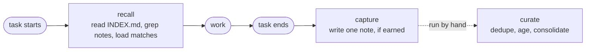

# perpetuity

> Cross-session memory for Claude. It records how you solved a hard problem and pulls it back the next time you hit one.

Claude forgets everything between sessions. perpetuity keeps the part worth keeping: how the hard problems got solved. It is one small skill on the [agentskills.io](https://agentskills.io) standard, and it sits beside your other skills without competing for attention. Its job is memory. It stays out of how your code gets written.

It runs at the seams of a conversation, not on a clock. No daemon, no background thread, nothing running while you sleep, because a skill cannot do those things. So perpetuity acts at the two edges of a task: it recalls when a task starts, and it captures when the task ends.

## The loop



## The three moves

Each one fails in its own way if you drop it.

| Move | Fires | What it does | Drop it and... |
|---|---|---|---|
| **Recall** | a non-trivial task starts | reads the small `INDEX.md`, greps `notes/` for tags and terms matching the task, loads only what matches | you have a diary nobody opens |
| **Capture** | the task ends | writes a single note, and only if the task earned one | the library stays empty |
| **Curate** | you run `/perpetuity-curate` | snapshots the library, ages notes from active to stale to archived, folds overlapping ones together | recall rots into near-duplicate sludge |

`INDEX.md` is always loaded; full notes are not, so recall stays cheap.

**What earns a note.** A task clears the capture bar when it is worth not re-deriving: a workflow that ran five or more steps and worked, a dead end you backed out of, a correction you had to make, a config quirk you would rather not hit twice. If nothing worth keeping happened, capture writes nothing. Over-saving is how a memory library turns to sludge.

Curate never deletes. Worst case, a note moves to `.archive/` and waits. It leaves pinned notes where they are, never touches a note you wrote by hand, and never reaches outside its own directory.

## Install

```
/plugin marketplace add blakecyze/perpetuity
/plugin install perpetuity
```

The notes live apart from the skill, so the plugin stays read-only and your memory survives updates. Uninstalling is just removing the plugin and deleting two directories:

| Scope | Lives in |
|---|---|
| Global memory | `~/.claude/perpetuity/` |
| Project memory | `.perpetuity/` inside the repo it belongs to |

Remove the plugin and delete those two directories and perpetuity is gone. No traces, no leftover config.

## What is in here

| Path | Purpose |
|---|---|
| `skills/perpetuity/SKILL.md` | the whole protocol: recall, capture, curate, the capture bar, the schema |
| `skills/perpetuity/notes/_example.md` | one filled-in note that shows the schema |
| `skills/perpetuity/INDEX.md` | the bounded index that is always loaded, built from note frontmatter |
| `skills/perpetuity/reindex.py` | a 30-line, stdlib-only script that rebuilds `INDEX.md` |
| `docs/` | the design dossier, and the reasoning behind each choice |

## Safety

perpetuity never deletes on its own. Every note records how far to trust it, what it replaces, where it came from, its current state, and the date it last proved useful. Curate respects all of it.

## Licence

MIT. See [LICENSE](LICENSE).
